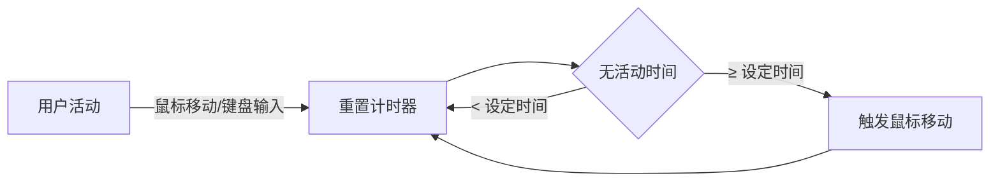

<div align="center">

# 🖱️ MouseKeepAlive

**一款轻量级的 macOS 防休眠工具**

[](https://www.apple.com/macos)
[](https://swift.org)
[](LICENSE)

[English](README.md) | [简体中文](README_CN.md)

</div>

---

## 📖 简介

MouseKeepAlive 是一款专为 macOS 设计的菜单栏应用，可以智能监测鼠标和键盘活动，在检测到用户无活动时自动模拟鼠标移动，从而：

- 🚫 防止系统进入休眠状态
- 💻 保持在线状态（防止企业监控软件检测离线）
- 🎯 避免屏保启动
- ⏰ 自定义检测时间和移动范围

## ✨ 功能特点

### 核心功能
- 🎯 **智能监测**：同时监测鼠标和键盘活动，打字时不会误触发
- ⚙️ **灵活配置**：可自定义休眠检测时间（5/10/30/60/120秒）
- 📏 **可调移动范围**：支持 5/10/20/50 像素的移动范围
- 💾 **配置持久化**：设置自动保存，重启后保持

### 用户体验
- 🎨 **菜单栏集成**：常驻菜单栏，不占用 Dock 空间
- 🔒 **隐私安全**：本地运行，不收集任何数据
- ⚡ **轻量高效**：资源占用极小，对系统性能无影响
- 🌐 **开箱即用**：无需复杂配置，启动即可使用

## 📦 安装

### 方式一：下载预编译版本（推荐）

1. 前往 [Releases](https://github.com/yourusername/MouseKeepAlive/releases) 页面
2. 下载最新版本的 `MouseKeepAlive.app.zip`
3. 解压后拖入「应用程序」文件夹
4. 首次打开可能需要右键点击 -> 打开

### 方式二：从源码编译

**前置要求**
- macOS 13.0 或更高版本
- Xcode 15.0 或更高版本

**使用 Xcode 编译**

```bash
# 1. 克隆仓库
git clone https://github.com/yourusername/MouseKeepAlive.git
cd MouseKeepAlive

# 2. 打开项目
open MouseKeepAlive.xcodeproj

# 3. 在 Xcode 中按 Cmd + R 运行
```

**使用命令行编译**

```bash
# 编译
xcodebuild -project MouseKeepAlive.xcodeproj \
           -scheme MouseKeepAlive \
           -configuration Release \
           build

# 运行
open ~/Library/Developer/Xcode/DerivedData/MouseKeepAlive-*/Build/Products/Release/MouseKeepAlive.app
```

## 🔐 权限设置

MouseKeepAlive 需要**辅助功能权限**来监听全局键盘事件和控制鼠标移动。

### 首次运行

1. 启动应用时会自动弹出权限请求对话框
2. 点击「打开系统设置」
3. 在「辅助功能」列表中勾选 `MouseKeepAlive`
4. 重启应用

### 手动授权

如果错过了自动提示，可以手动设置：

**系统设置** → **隐私与安全性** → **辅助功能** → 勾选 `MouseKeepAlive`

### 检查权限状态

点击菜单栏图标 → **检查辅助功能权限**

## 🎮 使用说明

### 快速开始

1. **启动应用**：双击运行，菜单栏会出现鼠标图标 🖱️
2. **配置参数**：点击菜单栏图标进行个性化设置
3. **开始使用**：应用自动在后台工作，无需额外操作

### 菜单选项

<table>
<tr>
<td width="200"><b>🕐 休眠检测时间</b></td>
<td>
设置多久无活动后触发鼠标移动<br>
<code>5秒 | 10秒 | 30秒 | 60秒 | 120秒</code><br>
默认：10秒
</td>
</tr>
<tr>
<td><b>📏 鼠标移动范围</b></td>
<td>
设置鼠标移动的像素范围<br>
<code>±5px | ±10px | ±20px | ±50px</code><br>
默认：±10px
</td>
</tr>
<tr>
<td><b>🔍 检查权限</b></td>
<td>查看辅助功能权限状态</td>
</tr>
<tr>
<td><b>❌ 退出</b></td>
<td>完全退出应用</td>
</tr>
</table>

### 工作原理



- ✅ 检测到鼠标移动 → 重置计时器
- ✅ 检测到键盘输入 → 重置计时器
- ⏰ 无活动达到设定时间 → 自动移动鼠标

## 🛠️ 技术实现

<table>
<tr>
<td><b>编程语言</b></td>
<td>Swift 5.0</td>
</tr>
<tr>
<td><b>UI 框架</b></td>
<td>SwiftUI + Cocoa</td>
</tr>
<tr>
<td><b>系统要求</b></td>
<td>macOS 13.0+</td>
</tr>
<tr>
<td><b>核心技术</b></td>
<td>
• NSEvent 全局事件监听<br>
• CGEvent 鼠标控制<br>
• UserDefaults 配置持久化<br>
• Timer 定时检测
</td>
</tr>
</table>

### 项目结构

```
MouseKeepAlive/
├── MouseKeepAliveApp.swift    # 应用入口
├── AppDelegate.swift           # 菜单栏管理
├── MouseMonitor.swift          # 核心监控逻辑
├── AppSettings.swift           # 配置管理
├── Info.plist                  # 应用配置
└── README.md                   # 项目文档
```

## ⚠️ 注意事项

- ✅ 应用需要辅助功能权限才能正常工作
- 🎨 应用常驻菜单栏，不会出现在 Dock 中
- 💾 配置保存在本地，卸载时会自动清理
- 🔒 仅在本地运行，不会联网或收集数据

## 🐛 问题排查

遇到问题？查看 [调试指南](DEBUG.md) 获取详细的排查步骤。

常见问题：
- 键盘监听不工作 → 检查辅助功能权限并使用英文输入法测试
- 权限总是弹窗 → 开发模式正常现象，正式版只需授权一次
- 无法检测字母键 → 切换到英文输入法（ABC）

## 🤝 贡献

欢迎贡献代码、报告问题或提出建议！

1. Fork 本仓库
2. 创建特性分支 (`git checkout -b feature/AmazingFeature`)
3. 提交更改 (`git commit -m 'Add some AmazingFeature'`)
4. 推送到分支 (`git push origin feature/AmazingFeature`)
5. 开启 Pull Request

查看 [贡献指南](CONTRIBUTING.md) 了解更多详情。

## 📄 许可证

本项目采用 MIT 许可证 - 查看 [LICENSE](LICENSE) 文件了解详情。

## 💖 致谢

感谢所有为这个项目做出贡献的开发者！

---

<div align="center">

**如果这个项目对你有帮助，欢迎给个 ⭐️**

Made with ❤️ by [Your Name](https://github.com/yourusername)

</div>
